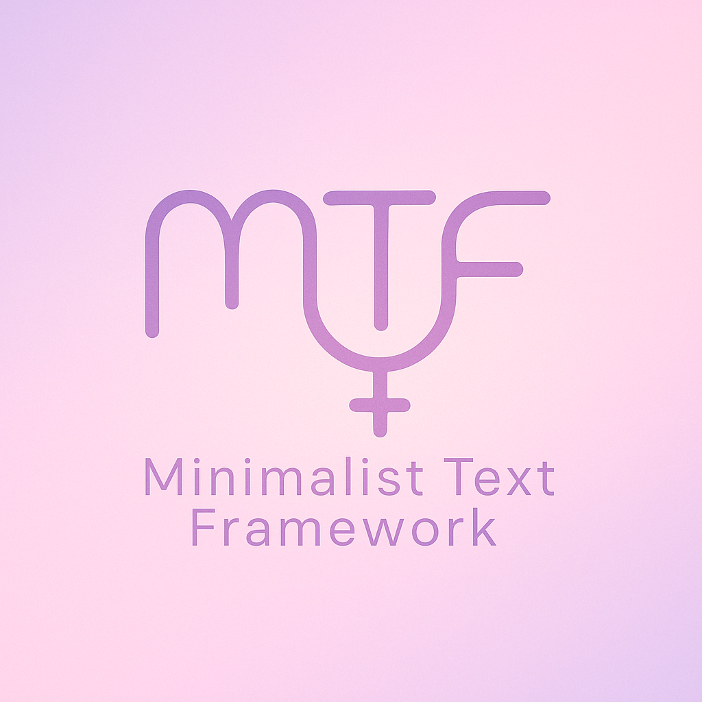
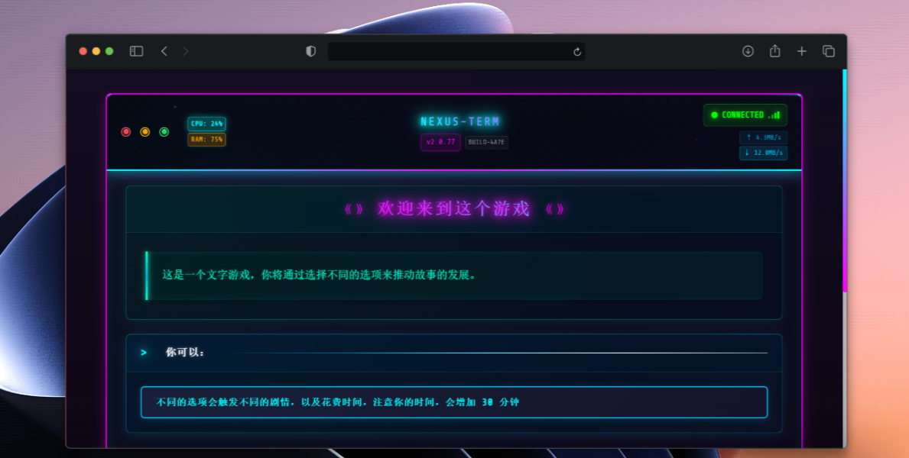

# MinimalistTextFramework

<div align="center">
  
  
  <h3>🎮 极简主义文本游戏框架</h3>
  <p>一个现代化的、可扩展的文本冒险游戏开发框架</p>
  
  
  
  
</div>

## ✨ 特性

### 🎨 现代化UI设计
- **赛博朋克风格**：霓虹色彩搭配，科幻感十足
- **响应式设计**：完美适配桌面和移动设备
- **打字机效果**：沉浸式的文本显示动画
- **动态状态栏**：实时显示CPU、内存使用率等系统信息

### 🎯 强大的游戏功能
- **场景系统**：基于JSON的灵活场景定义
- **状态管理**：完整的玩家属性和游戏状态追踪
- **事件系统**：支持临时事件和复杂交互逻辑
- **存档系统**：本地存储 + 文件导入导出功能
- **条件系统**：支持复杂的条件判断和概率事件

### 🔧 开发者友好
- **模块化架构**：清晰的组件分离，易于维护
- **TypeScript支持**：完整的类型安全保障
- **热重载**：开发时实时预览更改
- **场景验证**：内置脚本检查场景完整性

## 🚀 快速开始



### 环境要求
- Node.js 18+ 以及 Bun
- 现代浏览器

### 安装

```bash
# 克隆项目
git clone https://github.com/your-username/MinimalistTextFramework.git
cd MinimalistTextFramework

# 安装 Bun (如果没有安装)
npm install -g bun
# 安装依赖
bun i
```

### 运行

```bash
# 开发模式
bun dev

# 构建生产版本
bun run build

# 预览构建结果
bun run preview
```

访问 `http://localhost:4321` 开始游戏！

## 📖 使用指南

### 🎮 运行 Demo

项目已经包含了一个完整的演示游戏，展示框架的各种功能：

1. **启动游戏**：运行 `bun dev` 后访问 `http://localhost:4321`
2. **体验功能**：
   - 基础场景切换和时间系统
   - 条件显示（隐藏选项会在满足条件后出现）
   - 概率事件（低概率触发的场景转换）
   - 状态修改（隐藏变量的增加）

### 📝 创建游戏内容

#### 1. 数据文件组织
- **位置**：所有游戏数据文件放在 `src/data/` 目录下
- **格式**：JSON文件，可以任意命名（如 `story.json`、`characters.json`）
- **结构**：支持文件夹嵌套管理，如：
  ```
  src/data/
  ├── main-story.json      # 主线剧情
  ├── characters/          # 角色相关
  │   ├── npc.json
  │   └── dialogue.json
  └── locations/           # 地点场景
      ├── city.json
      └── dungeon.json
  ```

#### 2. 场景定义格式
```json
{
  "scene_id": {
    "name": "场景名称",
    "description": "场景描述，支持**粗体**和*斜体*",
    "exits": {
      "动作选项": {
        "time": 30,                    // 消耗时间（分钟）
        "condition": {                 // 显示条件（可选）
          "playerStats.health": ">50"
        },
        "probability": 0.8,            // 成功概率（可选）
        "results": [
          {
            "modify": {                // 修改游戏状态
              "playerStats.money": {
                "subtract": 10         // 支持 add, subtract, set, multiply
              }
            }
          },
          {
            "nextScene": "target_scene" // 跳转到下一个场景
          }
        ]
      }
    }
  }
}
```

#### 3. 配置起始场景
在 `src/components/GameInterface.astro` 中修改：
```javascript
const initialSceneId = "your_start_scene";
```

### 🎮 游戏系统详解

#### 玩家属性
- **health**: 生命值 (0-100)
- **energy**: 精力值 (0-100) 
- **money**: 金钱
- **inventory**: 物品清单 (开发中)
- **自定义属性**: 可添加任意属性，如 `hiddenState`

#### 时间系统
- 支持分钟级别的时间推进
- 自动计算日期和时间显示
- 可通过行动消耗时间

#### 条件系统
支持多种比较运算符：
```json
{
  "condition": {
    "playerStats.health": ">50",     // 大于
    "playerStats.money": ">=100",    // 大于等于
    "gameFlags.hasKey": true,        // 布尔值
    "playerStats.level": 5           // 等于
  }
}
```

#### 概率系统
```json
{
  "results": [
    {
      "probability": 0.7,            // 70% 概率
      "nextScene": "common_event"
    },
    {
      "nextScene": "rare_event"      // 1 - 70% = 30% 概率
    }
  ]
}
```

或者直接用 "probability" 让选项有概率出现。

## 🔍 开发工具

### 场景验证
使用内置的Python脚本验证场景完整性：
```bash
python scripts/validate_scenes.py
```

### 项目结构
```
MinimalistTextFramework/
├── src/
│   ├── components/    # UI组件
│   ├── data/          # 游戏数据（场景定义）
│   ├── layouts/       # 页面布局
│   ├── pages/         # 页面路由
│   └── styles/        # 样式文件
├── assets/            # 静态资源
├── scripts/           # 开发工具
└── public/            # 公共文件
```

## 📱 存档系统

游戏支持多种存档方式：
- **自动存档**：游戏状态自动保存到浏览器本地存储
- **手动导出**：将存档导出为JSON文件
- **文件导入**：从文件恢复游戏进度
- **跨设备同步**：通过导入导出实现设备间数据同步

## 🤝 贡献

欢迎提交Issue和Pull Request！

1. Fork项目
2. 创建功能分支 (`git checkout -b feature/AmazingFeature`)
3. 提交更改 (`git commit -m 'Add some AmazingFeature'`)
4. 推送到分支 (`git push origin feature/AmazingFeature`)
5. 开启Pull Request

## 📄 许可证

本项目采用 MIT 许可证 - 查看 [LICENSE](LICENSE) 文件了解详情。

## 🙏 致谢

- [Astro](https://astro.build/) - 现代化的静态网站生成器
- [Claude](https://claude.ai/) - AI助手，协助项目开发和文档编写
- 所有贡献者和测试用户 (我自己)

---

<div align="center">
  <p>用 ❤️ 和 ☕ 制作</p>
  <p><a href="#top">回到顶部</a></p>
</div> 